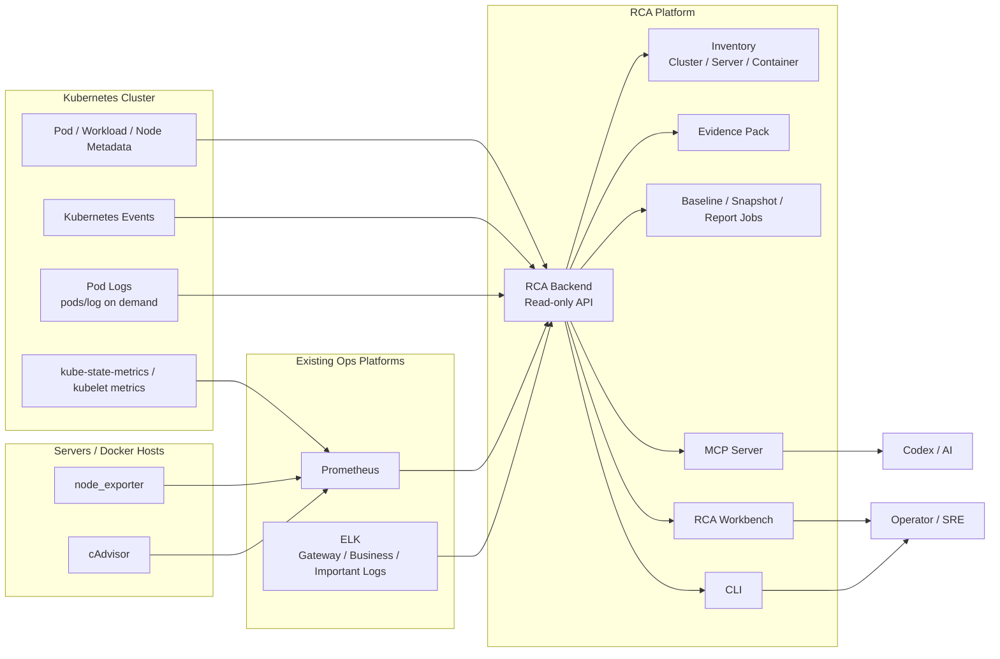

# RCA 架构图

## 总体架构

当前推荐架构采用轻量化设计：Prometheus 负责指标，ELK 负责网关/业务/关键系统日志，Kubernetes API 负责资源状态、事件和按需 Pod 日志，RCA Backend 作为统一只读分析入口。

RCA 平台不默认自建 OpenSearch，不默认全量采集 Kubernetes 容器日志。

## 核心链路

### 1. 指标链路

- Prometheus 继续作为指标底座。
- Kubernetes 集群通过 kube-state-metrics、kubelet、node_exporter 等提供 Pod、Node、Workload 指标。
- Docker 主机通过 `node_exporter + cAdvisor` 接入 Prometheus。
- RCA Backend 只读查询 Prometheus，做资源概览、TopN、趋势和告警证据聚合。

### 2. 日志链路

日志采用分层策略：

- Kubernetes Pod 日志不默认全量写入 OpenSearch/ELK。
- RCA Backend 通过 Kubernetes RBAC 的 `pods/log` 权限按需读取短窗口日志。
- CrashLoopBackOff、容器重启等场景支持读取 `previous` 日志。
- 网关日志、业务日志、关键系统日志继续进入 ELK，用于长期检索、504 排查、业务链路关联和审计。

Pod 日志查询必须限制：

- `tail_lines`
- `since_seconds`
- `limit_bytes`
- `namespace`
- `pod`
- `container`
- `previous`

### 3. 资源资产链路

- Kubernetes API 提供 Namespace、Pod、Service、Deployment、StatefulSet、DaemonSet、Node 等资源清单。
- Prometheus 提供服务器、节点、容器资源指标。
- Docker 主机通过 Prometheus 标签归一为 `runtime=docker`。
- RCA Backend 聚合为统一 Inventory 模型，供 UI、CLI、MCP 和 AI 查询。

### 4. 事件与调查链路

- 自动巡检、基线、健康快照和报告生成放到异步 Job。
- 在线 API 不做全量重计算，只查询预计算结果和短窗口实时证据。
- Evidence Pack 聚合指标、资源状态、Kubernetes Event、按需 Pod 日志、ELK 网关/业务日志和发布变更。
- AI 只通过 MCP 调用 RCA Backend 的只读工具。

## 默认部署边界

默认部署：

- RCA Backend
- MCP Server
- RCA UI
- 巡检和基线 CronJob
- Kubernetes 只读 RBAC，包含 `pods/log`
- Prometheus 查询配置
- ELK 查询配置

默认不部署：

- RCA 自带 OpenSearch
- RCA 自带 OpenSearch Dashboards
- RCA 自带 MinIO
- RCA 自带 MySQL
- eBPF / profiling 组件

这些组件仅作为可选模块，在没有现成日志平台、需要长期调查归档、需要深度内核/性能排查时再启用。

## Codex 智能接入扩展

Codex / AI 不直接访问 Kubernetes、Prometheus 或 ELK，而是通过 MCP 调用 RCA Backend：

- `Evidence Pack API`：面向 Pod、Workload、Service、Incident 返回结构化证据包。
- `Inventory API`：查询集群、服务器、Docker 主机、容器和资源使用情况。
- `Pod Logs API`：按需读取短窗口 Pod 当前日志和 previous 日志。
- `Snapshot API`：读取巡检、基线、健康快照和报告结果。
- `Release Context API`：关联 GitLab、Argo CD、镜像版本和发布变更。

详细演进方案见 `docs/cn/slim_ops_architecture.md`。
