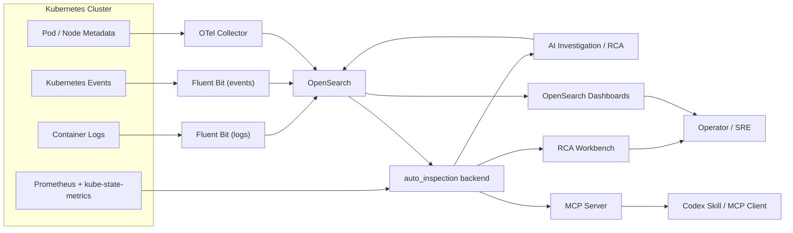

# RCA 架构图

## 总体架构

## Codex 智能接入扩展

后续 Codex 接入层建议在 `backend API -> MCP / Skill` 之间增加统一上下文能力：

- `Evidence Pack API`：面向 Pod、Workload、Service、Incident 返回结构化证据包。
- `Snapshot Index`：沉淀异常、趋势、发布变更、业务错误和依赖健康的预计算摘要。
- `MCP Resources`：用 `pod://`、`workload://`、`incident://` 等对象化 URI 暴露稳定上下文。
- `AI Gateway`：统一权限、脱敏、上下文裁剪、工具路由和审计。
- `CLI Evidence Commands`：支持本地和自动化场景生成可复用证据包。

详细方案见 `docs/cn/codex_intelligent_data_access.md`。

## 核心链路

### 1. 数据采集链路

- 容器日志通过 Fluent Bit 写入 `logs-k8s-*`
- Kubernetes Events 通过 Fluent Bit 写入 `events-k8s-*`
- Prometheus 与 kube-state-metrics 提供 Pod / Node 指标上下文

### 2. 事件与调查链路

- pipeline 生成 incident，写入 `inspection-incidents-*`
- 后端读取 incidents、logs、events、Prometheus 数据
- 后端生成 investigation，写入 `inspection-investigations-*`

### 3. 使用入口

- Dashboards 提供搜索和图表
- RCA 页面提供摘要和一键调查
- MCP / Skill 提供对话式调用入口
