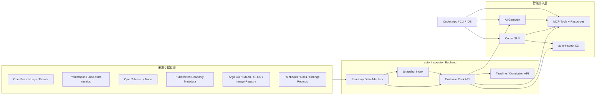

# Codex 智能数据接入设计

本文记录在现有 `Skill + MCP + backend HTTP` 基础上，进一步把采集数据智能接入 Codex、AI Gateway 和 CLI 的设计方向。本文只描述方案，不代表已经完成代码实现。

## 1. 当前基线

当前推荐模式已经固定为：

```text
Skill 触发 + MCP 优先 + backend HTTP 回退
```

现有能力包括：

- Skill 用于触发固定排障流程和本地 CLI 脚本。
- MCP server 将 backend 只读能力暴露为结构化工具。
- backend 统一读取 OpenSearch、Prometheus、Kubernetes metadata、Trace、发布变更、Argo CD 等数据。
- MCP 安全边界保持只读，不 SSH、不执行服务器命令、不修改 Kubernetes 或基础设施资源。

这个模式已经适合“对话式查询”和“只读证据汇总”。下一阶段的目标不是简单增加更多 MCP 工具，而是减少 Codex 临场拼接证据的成本，让 Codex 直接获得结构化、脱敏、可审计的上下文包。

## 2. 目标

下一阶段目标：

- 让 Codex 面向 Pod、Workload、Service、Incident 能直接读取完整上下文。
- 将日志、事件、指标、Trace、发布变更、业务字段和 runbook 汇聚为统一 Evidence Pack。
- 让 AI Gateway 管理权限、脱敏、上下文裁剪、工具路由和审计。
- 让 CLI 能生成离线证据包，供 Codex、MCP、Web 页面和人工排障复用。
- 保持只读边界，所有修复动作只输出建议和证据，由人确认后进入运维流程。

## 3. 总体架构



## 4. Evidence Pack

Evidence Pack 是下一阶段最核心的抽象。它把多个原子数据源提前组织成一份面向排障的问题上下文。

建议新增后端只读 API：

```text
GET /api/context/pod
GET /api/context/workload
GET /api/context/service
GET /api/context/incident
GET /api/context/namespace
```

典型入参：

- `cluster`
- `namespace`
- `pod`
- `workload_name`
- `workload_kind`
- `service`
- `incident_id`
- `symptom`
- `range_hours`

建议返回结构：

```json
{
  "mode": "read_only_evidence_pack",
  "target": {},
  "safety": {
    "server_commands": "not_allowed",
    "kubernetes_mutations": "not_allowed",
    "secrets": "redacted"
  },
  "summary": {},
  "symptoms": [],
  "timeline": [],
  "metrics": {},
  "logs": [],
  "events": [],
  "traces": [],
  "recent_changes": [],
  "runtime": {},
  "dependencies": {},
  "runbooks": [],
  "risk_signals": [],
  "likely_causes": [],
  "next_checks": [],
  "links": {},
  "errors": []
}
```

设计原则：

- Evidence Pack 只返回摘要、证据和链接，不返回大段原始日志。
- 原始日志、Trace、发布详情通过链接或二次工具查询展开。
- 敏感字段在 backend 或 AI Gateway 统一脱敏。
- 每个字段保留来源信息，便于审计和回溯。

## 5. Snapshot Index

当前很多分析是用户发问后临时查询。为了让 Codex 更快更稳，建议增加 Snapshot Index。

推荐快照类型：

- 异常 Pod 快照：重启、OOM、CrashLoop、Pending、ImagePull、Probe failure。
- 资源趋势快照：CPU 快速上涨、内存快速上涨、Throttle、Working Set、Node pressure。
- 发布变更快照：Deployment revision、Argo CD sync、Git revision、image digest、ConfigMap revision。
- 业务错误快照：错误码 TopN、慢请求 TopN、受影响 route / tenant / user / order。
- 依赖健康快照：DB 慢查询、Redis/MQ 延迟、Gateway upstream 错误率。

建议落地方式：

```text
collector / pipeline / scheduled job
  -> compute snapshots
  -> write snapshot index
  -> backend context APIs read snapshot first
  -> MCP / AI Gateway / CLI consume context APIs
```

价值：

- 降低每次对话实时查询成本。
- 支持 TopN、趋势和时间线预计算。
- Codex 获得的是压缩后的信号，而不是散乱的原始数据。

## 6. MCP Resources

当前 MCP 主要以 tools 为主。下一阶段可以增加 MCP Resources 或 Resource Templates，让 Codex 以对象方式读取上下文。

建议资源 URI：

```text
pod://<cluster>/<namespace>/<pod>
workload://<cluster>/<namespace>/<kind>/<name>
service://<cluster>/<service>
incident://<incident_id>
release://<cluster>/<namespace>/<workload>
namespace://<cluster>/<namespace>
```

资源返回内容应当直接映射 Evidence Pack 或其轻量摘要。

适用场景：

- IDE 中用户提到一个 Pod，Codex 能读取 `pod://...` 上下文。
- 用户打开某个 incident，Codex 能读取 `incident://...`。
- 用户追问发布变更，Codex 能读取 `release://...`。

Tools 仍保留用于主动查询，例如搜索日志、搜索 Trace、发起 investigation。

## 7. AI Gateway 定位

AI Gateway 不建议只作为 LLM 转发层。它更适合作为智能接入治理层。

建议职责：

- 权限策略：限制哪些数据可以交给 Codex。
- 脱敏策略：处理 token、secret、手机号、邮箱、用户 ID、订单 ID 等字段。
- 上下文裁剪：按问题类型裁剪 Evidence Pack，避免超长上下文。
- 工具路由：决定调用 MCP、backend API、Snapshot Index 还是 CLI 产物。
- 模型选择：简单摘要用低成本模型，复杂 RCA 用高能力模型。
- 审计记录：记录谁在什么时间访问了哪些证据、调用了哪些工具。
- 预算控制：限制一次对话可查询的日志量、Trace 数量和时间窗口。

推荐链路：

```text
Codex / CLI / Web
  -> AI Gateway
  -> Policy / Redaction / Context Builder
  -> MCP / backend / Snapshot Index
  -> Evidence Pack
  -> Codex
```

## 8. CLI 定位

CLI 不只作为 Skill 脚本入口。下一阶段建议将它设计成证据包生成器和离线调试工具。

建议命令：

```powershell
auto-inspect context pod --namespace minio --pod minio4-0 --range-hours 6 --out evidence.json
auto-inspect context workload --namespace prod --workload minio --format markdown
auto-inspect snapshot namespace --namespace prod --since 24h
auto-inspect explain evidence.json
auto-inspect redact evidence.json --out evidence.redacted.json
```

价值：

- 本地排障和自动化任务可以复用同一份 Evidence Pack。
- CI/CD、定时任务、人工排障、Codex 对话可以使用同一套证据格式。
- 在 MCP 不可用时，Skill 仍可通过 CLI 调 backend 生成上下文。

## 9. 推荐演进顺序

建议按以下顺序推进：

1. `Evidence Pack API`
   先把 `diagnose_pod` 泛化为 `get_context_pack`，覆盖 Pod、Workload、Service、Incident。

2. `Snapshot Index`
   预计算异常、趋势、发布变更、业务错误和依赖健康信号。

3. `MCP Resources`
   在 tools 之外增加稳定对象上下文，例如 `pod://`、`workload://`、`incident://`。

4. `AI Gateway`
   统一权限、脱敏、上下文裁剪、工具路由和审计。

5. `CLI Evidence Commands`
   让本地、CI、自动化任务和 Codex 共享同一证据包格式。

## 10. 安全边界

保持现有只读原则：

- 不允许 MCP、AI Gateway 或 CLI 默认执行 SSH。
- 不允许自动修改 Kubernetes 对象。
- 不允许读取 Secret 正文。
- 不允许直接修改 OpenSearch、Prometheus、MinIO、MySQL 等基础设施配置。
- 不允许自动重启、扩缩容、cordon、drain、patch、apply、delete。

允许：

- 查询只读 API。
- 生成 Evidence Pack。
- 生成 investigation 记录。
- 返回建议动作、风险说明、支持证据和验证方式。

## 11. 与现有文档关系

本文是以下文档的下一阶段设计补充：

- `docs/codex_integration.md`
- `docs/codex_mcp_integration.md`
- `docs/cn/mcp_readonly_observability_roadmap.md`
- `docs/cn/log_correlation_minimal_plan.md`
- `docs/cn/otel_business_correlation.md`
- `docs/cn/release_change_correlation.md`

后续进入实现阶段时，应按 `docs/cn/mcp_skill_change_record_template.md` 新增变更记录，并分别记录 backend API、MCP tools/resources、Skill、CLI 和 AI Gateway 的实际修改。
