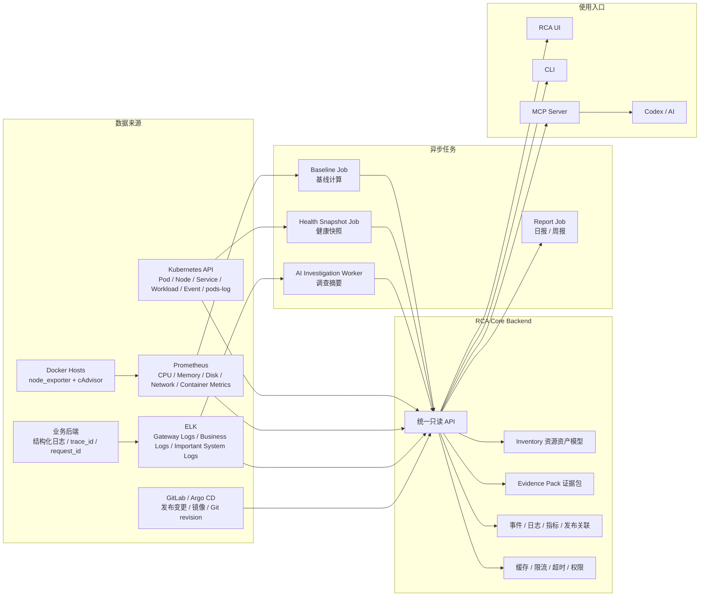

# RCA 平台瘦身与统一运维入口架构方案

## 背景

当前 `auto_inspection` 已经具备 Kubernetes 资源查询、Prometheus 指标查询、日志/事件检索、GitLab/Argo CD 发布变更关联、MCP/CLI 只读调用和自动巡检能力。

随着接入内容增多，平台开始出现几个问题：

- OpenSearch、OpenSearch Dashboards、MinIO、MySQL、eBPF、profiling 等组件全部放进默认部署后，整体过重。
- Kubernetes 容器日志如果全量写入 OpenSearch/ELK，会带来较高的磁盘、索引、JVM 和保留策略维护成本。
- Python Backend 同时承担在线查询、RCA 聚合、AI 调查、巡检任务和 MCP 工具入口，后续多人使用时并发承载边界不清晰。
- 自动巡检、基线、日志搜索、资源清单、深度观测被放在同一条主链路里，架构职责不够清楚。
- eBPF 类组件对内核版本、权限和运行环境要求较高，当前阶段对日常排障收益有限。

下一版架构目标不是继续堆采集组件，而是把平台收敛成“统一运维入口 + 只读 RCA 分析层”。

## 目标定位

RCA 平台的核心定位：

- 不替代 Prometheus。
- 不替代 ELK。
- 不默认自建 OpenSearch 日志平台。
- 不默认全量采集 Kubernetes 容器日志到搜索引擎。
- 不默认承担所有遥测数据长期存储。
- 作为统一运维入口，聚合指标、按需 Pod 日志、业务/网关日志、Kubernetes/Docker 资源、发布变更、备份校验和巡检结果。
- 通过 API、UI、CLI、MCP 暴露只读排障能力，让 AI 能实时查询当前环境。

推荐原则：

- 指标归 Prometheus。
- Kubernetes 容器日志默认按需通过 Kubernetes API `pods/log` 读取。
- 网关日志、业务日志、关键系统日志继续归 ELK。
- 集群资源归 Kubernetes API。
- Docker/普通服务器资源归 node_exporter + cAdvisor。
- RCA Backend 负责统一查询、关联、聚合、缓存、权限和证据包。
- Python 主要负责 AI、MCP、巡检、报告、离线分析。
- eBPF、profiling、安全运行时事件作为可选高级模块。

## 目标架构



## 默认部署边界

默认部署只保留平台主链路：

- `rca-backend`
  - 当前可继续使用 Python 版本。
  - 后续建议演进为 Go / Java 的 `rca-core`，承载在线高并发查询。
- `rca-mcp`
  - 对 AI 暴露只读工具。
  - 可继续使用 Python。
- `rca-ui`
  - 统一运维入口页面。
- `rca-cronjobs`
  - 巡检、基线、健康快照、报告生成。
- Kubernetes 只读 RBAC。
  - 包含 `pods/log`，用于按需读取 Pod 当前日志和 previous 日志。
- Prometheus 查询配置。
- ELK 查询配置。

默认不再部署：

- RCA 自带 OpenSearch。
- RCA 自带 OpenSearch Dashboards。
- RCA 自带 MinIO。
- RCA 自带 MySQL。
- Beyla / Falco / Pyroscope / Alloy eBPF。

这些组件保留为可选模块，按场景开启。

## 轻量日志策略

默认不再由 RCA 平台全量采集 Kubernetes 容器日志，也不要求部署 RCA 自带 OpenSearch。

日志分层如下：

| 日志类型 | 默认去向 | 用途 | 说明 |
| --- | --- | --- | --- |
| Kubernetes Pod 当前日志 | Kubernetes API `pods/log` 按需读取 | 排查某个 Pod / Workload 最近异常 | 不长期保存到 RCA 平台 |
| Kubernetes Pod previous 日志 | Kubernetes API `pods/log?previous=true` 按需读取 | 排查 CrashLoopBackOff、容器重启 | 受 kubelet/container runtime 日志轮转影响 |
| Kubernetes Event | Kubernetes API 或现有事件采集 | 调度失败、拉镜像失败、探针失败、驱逐等 | 可进入 Evidence Pack |
| 网关日志 | ELK | 504、5xx、慢请求、入口流量分析 | 建议保留 APISIX/Nginx/Ingress 日志 |
| 业务日志 | ELK | 根据 `trace_id`、`request_id`、`user_id`、`order_id` 关联问题 | 由业务后端输出结构化字段 |
| 普通服务器关键日志 | ELK 或现有日志平台 | 系统服务、数据库、中间件关键日志 | 按需接入，不做全量要求 |

### Pod 日志读取链路

```text
AI / UI / CLI
  -> RCA Backend
  -> Kubernetes API pods/log
  -> 限制 tail_lines / since_seconds / limit_bytes
  -> 脱敏 / 截断 / 摘要
  -> Evidence Pack / MCP 返回
```

推荐查询参数：

- `namespace`
- `pod`
- `container`
- `tail_lines`
- `since_seconds`
- `limit_bytes`
- `previous`
- `timestamps`
- `grep` 或 `q`

推荐接口：

- `GET /api/k8s/logs/pod`
- `GET /api/k8s/logs/workload`
- `GET /api/k8s/logs/recent`
- `GET /api/k8s/events`
- `GET /api/context/pod`
- `GET /api/context/workload`

### 最小 RBAC

RCA Backend 的 ServiceAccount 建议保留只读边界：

```yaml
apiGroups:
  - ""
resources:
  - pods
  - pods/log
  - events
  - namespaces
  - services
  - configmaps
verbs:
  - get
  - list
  - watch
---
apiGroups:
  - apps
resources:
  - deployments
  - statefulsets
  - daemonsets
  - replicasets
verbs:
  - get
  - list
  - watch
```

不授予：

- `create`
- `update`
- `patch`
- `delete`
- `exec`
- `attach`
- `portforward`
- `secrets` 正文读取

### 查询保护

Backend 必须限制日志查询，避免把 API Server 和 kubelet 打满：

- 默认 `tail_lines <= 300`。
- 默认 `since_seconds <= 1800`。
- 默认 `limit_bytes <= 1MiB`。
- 单次查询必须指定 namespace 和 Pod，workload 查询先选异常或最近重启的少量 Pod。
- 对 MCP 工具做更严格的返回大小限制。
- 对同一 Pod 的短时间重复查询做缓存。
- 对日志内容做脱敏和截断。

### 使用边界

适合：

- 最近异常 Pod 排查。
- CrashLoopBackOff previous 日志查看。
- 告警触发后拉取相关 Pod 最近日志。
- AI 生成 Evidence Pack。

不适合：

- 最近 7 天全局全文搜索。
- 合规审计长期留存。
- 大量用户持续 tail 全集群日志。
- 依赖已删除 Pod 的历史日志。

这类长期检索需求继续交给 ELK 或已有日志平台。

## 可选组件策略

| 模块 | 默认状态 | 适用场景 | 建议 |
| --- | --- | --- | --- |
| OpenSearch | 关闭 | 没有现成 ELK，且需要长期全文检索部分日志 | 放到 `optional/opensearch` |
| OpenSearch Dashboards | 关闭 | 需要单独查看 RCA 自建索引 | 放到 `optional/opensearch-dashboards` |
| MinIO | 关闭 | 需要长期保存调查归档、快照、报表对象 | 优先复用已有对象存储 |
| MySQL | 关闭 | 需要结构化保存大量调查记录、用户配置、任务状态 | 小规模可先用文件/SQLite，规模化再接 |
| Beyla / OTel eBPF | 关闭 | 无侵入服务调用识别、无埋点 RED 指标 | 只在内核版本满足时启用 |
| Falco | 关闭 | 运行时安全事件、异常进程、敏感文件访问 | 安全场景按需启用 |
| Pyroscope / Alloy eBPF | 关闭 | CPU profile、性能热点、深度性能分析 | 性能专项排障时启用 |

## 统一资源资产能力

AI 要能够知道当前所有服务器资源，包括 Kubernetes 集群、Docker 主机和普通服务器。建议在 Backend 中建设统一 Inventory 模型。

### 资源类型

- `cluster`
  - Kubernetes 集群。
- `server`
  - 物理机、虚拟机、云主机。
- `node`
  - Kubernetes Node，可映射到 server。
- `docker_host`
  - 运行 Docker / Docker Compose 的服务器。
- `container`
  - Kubernetes 容器或 Docker 容器。
- `workload`
  - Deployment、StatefulSet、DaemonSet、Docker Compose service。
- `service`
  - Kubernetes Service、业务服务、网关路由。
- `application`
  - 业务应用。

### 标准字段

每个资源建议归一成以下字段：

- `id`
- `name`
- `type`
- `runtime`
  - `kubernetes`
  - `docker`
  - `baremetal`
- `cluster`
- `namespace`
- `host`
- `ip`
- `env`
- `site`
- `biz`
- `owner`
- `labels`
- `status`
- `metrics_ref`
- `logs_ref`
- `related_resources`

### 采集来源

Kubernetes 集群：

- Kubernetes API 查询资源状态。
- Prometheus 查询节点和容器指标。
- kube-state-metrics 查询 workload 副本、Pod 状态、资源对象状态。

Docker 主机：

- `node_exporter` 采集主机 CPU、内存、磁盘、网络。
- `cAdvisor` 采集 Docker 容器 CPU、内存、容器数量和运行状态。
- Prometheus scrape 时增加 `env`、`site`、`host`、`runtime=docker` 等标签。

普通服务器：

- `node_exporter` 采集主机指标。
- 如需日志，继续走现有 ELK/Filebeat/Fluent Bit。

## Backend API 规划

统一资源入口建议新增或收敛为：

- `GET /api/inventory/overview`
- `GET /api/inventory/clusters`
- `GET /api/inventory/servers`
- `GET /api/inventory/docker-hosts`
- `GET /api/inventory/containers`
- `GET /api/inventory/workloads`
- `GET /api/inventory/search`
- `GET /api/inventory/resources/{id}`
- `GET /api/inventory/resources/{id}/metrics`
- `GET /api/inventory/resources/{id}/logs`
- `GET /api/inventory/resources/{id}/context`
- `GET /api/k8s/logs/pod`
- `GET /api/k8s/logs/workload`
- `GET /api/k8s/logs/recent`

典型能力：

- 当前有多少服务器、多少 Kubernetes 集群、多少 Docker 主机。
- 每台服务器 CPU、内存、磁盘、网络使用情况。
- 每个 Docker 主机有多少容器，哪些容器资源最高。
- 每个 Kubernetes 节点有多少 Pod，哪些 Pod 异常。
- 模糊搜索任意资源，例如 `mysql`、`gateway`、`node200`。
- 对单个资源生成 Evidence Pack。
- 对指定 Pod / Workload 按需读取最近日志和 previous 日志。

## MCP / AI 工具规划

MCP 只暴露只读工具：

- `list_clusters`
- `list_servers`
- `list_docker_hosts`
- `list_containers`
- `search_resources`
- `get_server_overview`
- `get_resource_context`
- `get_pod_logs`
- `get_workload_logs`
- `top_hosts_by_cpu`
- `top_hosts_by_memory`
- `top_hosts_by_disk`
- `top_containers_by_cpu`
- `top_containers_by_memory`
- `list_abnormal_workloads`
- `list_recent_incidents`

AI 通过这些工具实时查询，不依赖模型记忆。

示例问题：

- 当前所有服务器资源有哪些？
- 哪些机器内存使用率最高？
- 哪台 Docker 主机容器最多？
- `mysql` 相关容器在哪些服务器上？
- 当前 Kubernetes 集群有多少异常 Pod？
- 这个 CrashLoopBackOff Pod 上一次退出前的日志是什么？
- 最近一次 504 涉及哪些网关日志、后端服务和发布变更？

## 自动巡检与基线优化

自动巡检和基线不建议放在在线查询链路里实时计算，而是拆成异步任务。

### 任务拆分

- `baseline-job`
  - 每小时或每天计算资源基线。
  - 例如 CPU p50/p95、内存 p50/p95、磁盘增长率、请求量 p95、错误率基线。
- `health-snapshot-job`
  - 周期性保存集群和服务器健康快照。
  - 例如异常 Pod、NotReady Node、磁盘高水位、容器重启 TopN。
- `incident-correlation-job`
  - 定时把告警、Kubernetes Event、网关/业务日志、发布变更做预关联。
  - 不定时扫描全量 Pod 日志，只在告警或调查时按需拉取候选 Pod 的短窗口日志。
- `report-job`
  - 生成日报、周报、巡检报告。
- `backup-verify-ingest-job`
  - 读取数据库备份校验 JSONL，生成备份健康状态。

## Backend 语言演进策略

后端不建议马上全量改成 Go，也不建议长期让 Python 承担所有在线高并发查询。

推荐拆分为：

```text
rca-core        Go / Java，在线主 API，高并发只读查询
rca-ai-worker   Python，AI 摘要、报告、复杂分析
rca-mcp         Python 或 Go，MCP 工具适配层
rca-cronjobs    Python，巡检、基线、备份校验、离线任务
rca-ui          前端，只调用 rca-core
```

### 为什么不立即全量重写

- 当前 Python Backend 已经有大量 Prometheus、Kubernetes、GitLab、Argo CD、MCP 和调查逻辑。
- 全量重写容易中断现有能力，也会增加验证成本。
- AI 调查、报告生成、MCP 适配、离线巡检并不是强并发场景，Python 更适合快速迭代。

### 为什么在线核心适合 Go

当用户数增加后，以下能力更适合放到 Go / Java：

- Inventory 资源资产查询。
- Kubernetes API 聚合查询。
- Pod 日志按需读取、限流、缓存、截断。
- Prometheus 查询代理和 TopN 聚合。
- ELK 查询代理。
- Evidence Pack 基础组装。
- 权限、审计、超时、连接池、并发控制。

Go 的优势：

- 单二进制部署简单。
- 并发模型适合大量 I/O 查询。
- 内存占用和启动速度更适合常驻服务。
- 类型约束更适合沉淀稳定 API。

### 演进步骤

P0：继续使用当前 Python Backend

- 增加查询限制、缓存、超时。
- MCP 和 UI 继续调用当前接口。
- 重任务放到异步 Job。

P1：冻结 API 契约

- 整理 `/api/inventory/*`、`/api/k8s/logs/*`、`/api/context/*`。
- 明确请求参数、返回结构、错误码和权限边界。
- Python 继续作为参考实现。

P2：新增 Go `rca-core`

- 先实现高频只读接口：
  - Inventory。
  - Pod logs on demand。
  - Prometheus resource query。
  - Kubernetes Event / Pod / Workload query。
- UI / CLI 逐步切到 Go `rca-core`。

P3：Python 后移

- Python 只保留：
  - AI investigation worker。
  - MCP tool adapter。
  - baseline/report jobs。
  - 特殊数据分析脚本。

P4：统一入口

- 所有在线入口只访问 `rca-core`。
- `rca-core` 再调用 Python worker 或读取异步结果。
- Python 不直接承担多人在线查询。

### 触发条件

满足以下任一条件时，建议开始 P1/P2：

- 多人同时使用 UI / MCP，查询延迟明显升高。
- Pod 日志、Prometheus、Kubernetes API 查询需要更严格限流。
- Backend CPU 或内存占用随用户数明显增长。
- 需要统一鉴权、审计和租户隔离。
- 需要一个稳定的总运维 API 网关。

当前阶段结论：

```text
不用马上把后端全部换成 Go。
但应该从现在开始按 Go rca-core 的边界设计 API。
先保留 Python 能力，再把在线高并发查询核心逐步迁移到 Go。
```

### 存储策略

小规模阶段：

- 巡检结果可保存在文件或 SQLite。
- 报告可保存在本地目录或已有对象存储。
- 只保留最近 N 天明细和更长周期的聚合摘要。

规模化阶段：

- 任务状态、资源快照、基线摘要可放 PostgreSQL/MySQL。
- 报告和调查归档可放对象存储。
- 网关、业务、关键系统日志明细继续留在 ELK，不复制到 RCA 平台。
- Kubernetes Pod 日志默认不做长期存储，由 RCA Backend 在调查时按需读取短窗口日志。

## 在线服务并发优化

短期：

- Python Backend 保留。
- 增加多副本部署。
- 增加超时、连接池、查询结果缓存。
- 重查询放到异步任务。
- MCP 调用限制返回条数，避免一次拉全量日志。
- Pod 日志查询限制 `tail_lines`、`since_seconds`、`limit_bytes`，并对 workload 日志查询限制候选 Pod 数量。

中期：

- 拆分 `rca-core` 和 `rca-ai-worker`。
- `rca-core` 用 Go / Java 承担在线 API。
- `rca-ai-worker` 继续用 Python 承担 AI 摘要、MCP 适配、报告生成。
- 用队列或任务表连接在线 API 和异步任务。

长期：

- `rca-core` 横向扩容。
- 按租户、集群、环境做权限和限流。
- 热数据缓存到 Redis 或进程内缓存。
- 巡检和基线任务独立扩容。

## GitOps 目录建议

建议把部署目录拆成默认组件和可选组件：

```text
deploy/
  rca-core/
  rca-mcp/
  rca-ui/
  rca-cronjobs/
  inventory-collectors/
    docker-node-exporter/
    docker-cadvisor/
  optional/
    opensearch/
    opensearch-dashboards/
    minio/
    mysql/
    ebpf-beyla/
    runtime-falco/
    profiling-pyroscope/
```

GitOps 默认只同步：

- `rca-core`
- `rca-mcp`
- `rca-ui`
- `rca-cronjobs`
- 必要 RBAC / ConfigMap / Service

可选组件通过单独 Kustomization 或 Argo CD Application 启用。

## 分阶段落地

### P0：文档与边界收敛

- 明确默认部署只保留 RCA 主链路。
- OpenSearch、MinIO、MySQL、eBPF 改为可选模块。
- 形成统一 Inventory 资源模型。

### P1：统一资源入口

- Backend 增加 `/api/inventory/*`。
- MCP 增加服务器、Docker、容器、集群资源查询工具。
- Docker 主机接入 `node_exporter + cAdvisor`。

### P2：巡检和基线异步化

- `baseline-job`
- `health-snapshot-job`
- `incident-correlation-job`
- `report-job`
- 结果供 Backend 查询，不在在线接口中做重计算。

### P3：Backend 承载升级

- 保留 Python 作为 AI/Worker/MCP 层。
- 新增 Go / Java `rca-core` 承担在线高并发入口。
- UI、CLI、MCP 都统一调用 `rca-core`。

### P4：按需高级诊断

- 网络、调用链不清楚时再启用 Beyla / OTel eBPF。
- 安全事件需要时再启用 Falco。
- 深度性能专项时再启用 Pyroscope / profiling。

## 当前建议结论

当前阶段最优方向：

```text
Prometheus 指标 + ELK 网关/业务日志 + Kubernetes API 资源/Pod日志 + Docker/node_exporter/cAdvisor
    -> RCA Backend 统一只读分析入口
    -> UI / CLI / MCP / AI
    -> 异步巡检和基线任务
```

不建议继续默认扩展 eBPF、OpenSearch、MinIO、MySQL 这类重组件。

RCA 平台应该变轻，成为“连接已有运维数据源的智能入口”，而不是重新建设一套完整观测平台。

其中日志策略应进一步收敛为：

```text
Kubernetes Pod 日志：RCA Backend 通过 RBAC 按需读取短窗口日志
网关/业务/关键系统日志：继续进入 ELK，用于长期检索和跨服务关联
RCA 平台：只保存调查摘要、证据包、巡检结果和必要的聚合信息
```
