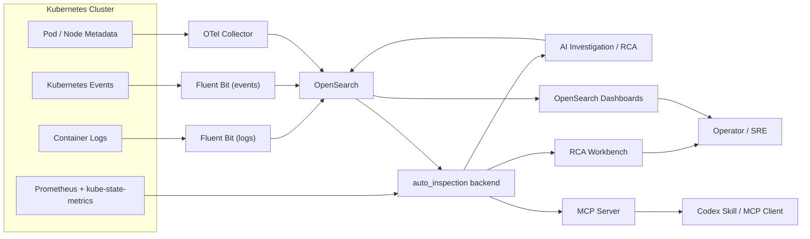

# RCA Architecture

## High-level Architecture

## Core Flows

### 1. Data Ingestion

- container logs are shipped by Fluent Bit into `logs-k8s-*`
- Kubernetes events are shipped by Fluent Bit into `events-k8s-*`
- Prometheus and kube-state-metrics provide Pod / Node metric context

### 2. Incident and Investigation Flow

- the pipeline generates incidents into `inspection-incidents-*`
- the backend reads incidents, logs, events, and Prometheus context
- the backend writes investigation results into `inspection-investigations-*`

### 3. User-facing Entry Points

- Dashboards provides search and charts
- the RCA page provides summary cards and one-click investigation
- MCP / Skill provides conversational access
