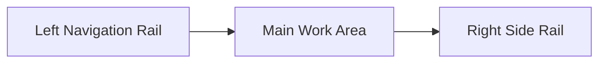

# RCA Frontend UI Design

## 1. Design Goal

The RCA page is not a generic operations dashboard. It is a troubleshooting
workbench.

Primary goals:

- show the conclusion and strongest signals first
- show root cause, actions, and timeline second
- make logs, events, and historical investigation entry points easy to reach
- support both active incident triage and postmortem review

## 2. Page Structure

The page uses three layers:

1. left navigation rail
2. main work area
3. right side rail

## 3. Top-level Layout

### 3.1 Left Navigation Rail

Purpose:

- create a real workbench feel
- provide anchor navigation
- keep brand and product identity visible

Contains:

- brand block
- section navigation
- design intent card

### 3.2 Main Work Area

The main area follows the real investigation order:

1. investigation input
2. summary cards
3. one-line conclusion
4. key signal summary
5. root causes / actions / human checks / timeline
6. Pod snapshot / Prometheus context
7. log evidence
8. Kubernetes events
9. original analysis prompt

### 3.3 Right Side Rail

The side rail is the "entry and navigation" area.

Priority order:

1. Current Incidents
2. Investigation Targets
3. Dashboard Links
4. Recent Investigations

Why:

- incidents and targets answer "what should I look at now"
- dashboards and history answer "where should I go next"

## 4. Component Design

### 4.1 Hero

Purpose:

- set the tone of the page
- make it clear this is an RCA workbench, not a generic log page

Requirements:

- clear title
- subtitle should emphasize "conclusion first"
- keep external entry buttons visible

### 4.2 Investigation Input

Fields:

- Namespace
- Pod
- Workload
- Range Hours
- Question
- Query Hint
- Use AI

Interaction requirements:

- launch investigation directly
- load latest investigation
- keep local form state when fields change

### 4.3 Summary Cards

The four summary cards are:

- Investigation ID
- Evidence Source
- Target Object
- Storage Status

Purpose:

- let the user quickly confirm what this result belongs to, where it came from,
  and whether it has been persisted

### 4.4 One-line Conclusion

Visual requirements:

- large type
- high visibility
- topmost content in the main area

Purpose:

- let users understand the current strongest judgment without reading raw tables

### 4.5 Key Signal Summary

Always highlight:

- Restart Total
- Restart Increase
- Waiting Reason
- Last Terminated Reason
- Memory Request / Limit
- CPU Request / Limit

Visual requirements:

- card-based layout
- risk color strips
- stronger colors for critical cards

### 4.6 Analysis Area

Layout:

- two-column analysis grid

Contains:

- ranked root causes
- recommended actions
- human checks
- timeline

Goal:

- explain "judgment -> evidence -> decision" with minimal scrolling

### 4.7 Runtime Context Area

Contains:

- Pod snapshot
- Prometheus context

Goal:

- provide structured state and resource context

### 4.8 Evidence Area

Contains:

- normalized log evidence table
- Kubernetes event table

Design requirements:

- wide tables are acceptable
- horizontal scrolling is acceptable
- raw evidence should not appear too early on the page

### 4.9 Right Side Rail

Requirements:

- sticky behavior on desktop
- always visible
- optimized for "where should I go next"

## 5. Visual Language

### 5.1 Tone

The page is not a traditional dark monitoring wall. The tone is:

- calm
- focused
- analytical

### 5.2 Color Rules

- keep the base background light for long-session readability
- use clear risk color strips for severe states
- reserve the accent color for actions and key emphasis

### 5.3 Cards and Elevation

- panels should feel layered but not heavy
- grouping between blocks must be obvious
- avoid turning the page into a single large white board

## 6. Responsive Behavior

### Desktop

- left rail, main work area, and side rail all visible
- side rail stays sticky

### Tablet / Narrow Screens

- left rail degrades
- main and side sections collapse into one column
- sticky behavior is removed

### Mobile

- main investigation flow takes priority
- side rail content moves below the main content

## 7. Content Priority Rules

The module priority inside the page is:

1. conclusion
2. high-risk signals
3. root causes and actions
4. timeline
5. runtime context
6. raw evidence
7. external jump links
8. history and recommendation entry points

## 8. Recommended Next Improvements

- finish the remaining Chinese copy cleanup in runtime strings
- add badges and counters to side rail cards
- strengthen Pod snapshot state coloring
- add sticky key columns and quick filters to evidence tables
- continue borrowing the density and navigation quality of Langfuse-style workbench layouts
