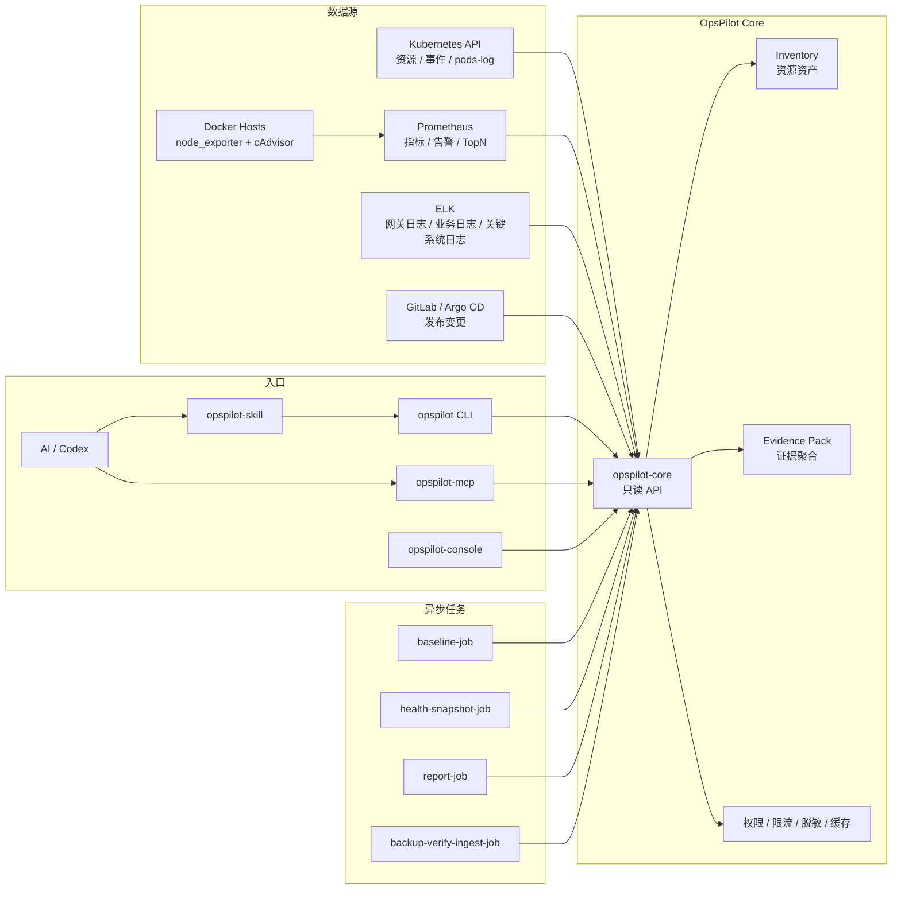

# OpsPilot 架构设计

## 总体架构

## 分层职责

### opspilot-core

在线主 API，后续建议使用 Go / Java 承载：

- Inventory 查询。
- Kubernetes 资源查询。
- Pod 日志按需读取。
- Prometheus 查询代理。
- ELK 查询代理。
- GitLab / Argo CD 只读查询。
- Evidence Pack 基础组装。
- 权限、审计、限流、缓存、超时。

### opspilot CLI

确定性命令入口：

- 暴露稳定命令。
- 暴露 `schema`。
- 返回结构化 JSON。
- 做认证、配置和权限边界。
- 人和 AI 都通过同一套命令工作。

### opspilot-skill

AI 编排说明：

- 判断用户问题属于哪类排障。
- 选择对应 CLI 命令。
- 先查 `schema` 和 shortcut。
- 区分只读命令和需要确认的命令。
- 把 JSON 结果整理成结论。

### opspilot-worker

异步任务：

- 自动巡检。
- 基线计算。
- 健康快照。
- 报告生成。
- 备份校验 JSONL 接入。

## 默认部署

- `opspilot-core`
- `opspilot-mcp`
- `opspilot-console`
- `opspilot-worker`
- Kubernetes 只读 RBAC，包含 `pods/log`
- Prometheus 查询配置
- ELK 查询配置

## 默认不部署

- OpenSearch
- OpenSearch Dashboards
- MinIO
- MySQL
- Beyla / Falco / Pyroscope / Alloy eBPF

这些组件只作为 optional 模块。
