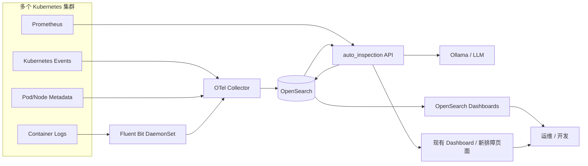

# auto_inspection 成品化方案

## 1. 目标

把当前仓库从“Prometheus 巡检脚本”演进成一个日志优先的 AI 排障成品，满足下面 4 个核心诉求：

1. 支持多集群 Kubernetes 日志统一检索。
2. 支持 Kubernetes Events、Pod 重启、告警、资源波动的联合检索。
3. 保留 Prometheus 作为事实来源，但主界面以日志搜索和排障为中心。
4. 使用 AI 基于日志、事件、指标上下文生成可追溯的排障结论，而不是只给一句泛化总结。

## 2. 设计原则

- 日志优先：用户首先进入日志检索和问题详情，而不是指标总览。
- 证据优先：AI 只能基于检索结果输出结论，必须附带证据片段和时间线。
- 开源优先：主方案采用 OpenSearch 生态，不依赖闭源 AI 功能。
- 渐进改造：尽量复用当前仓库的 Prometheus 异常检测、事件合并、Runbook、Ollama 总结能力。
- 多集群统一标签：所有数据统一落 `cluster / namespace / workload / pod / container / node / service / severity / env` 维度。

## 3. 推荐成品形态

产品定位建议定义为：

`Kubernetes 日志检索与 AI 排障平台`

对用户暴露 3 个主入口：

1. 日志检索
2. 问题时间线
3. AI 排障报告

弱化“周报脚本”形态，把现有周报能力沉淀成：

- 异常事件生成器
- AI 诊断引擎
- Runbook 建议引擎

## 4. 主方案架构

主方案：

`Fluent Bit + OpenTelemetry Collector + OpenSearch + OpenSearch Dashboards + Prometheus + auto_inspection API + Ollama`

### 4.1 架构图



### 4.2 各组件职责

- `Fluent Bit`
  - 采集容器标准输出日志。
  - 负责基础解析、多行合并、Kubernetes metadata enrichment。
- `OTel Collector`
  - 汇聚 Fluent Bit 输出。
  - 采集 Kubernetes Events。
  - 统一标签、过滤无效字段、路由到 OpenSearch。
- `OpenSearch`
  - 存储日志、K8s 事件、排障事件、AI 调查结果、Runbook 元数据。
- `OpenSearch Dashboards`
  - 提供日志搜索、时间线、聚合统计、问题回放页面。
- `Prometheus`
  - 继续作为指标事实来源。
  - 用于 AI 调查时补充重启次数、资源趋势、告警窗口。
- `auto_inspection API`
  - 负责检索编排、证据拼装、异常检测、AI 诊断、Runbook 组装、结果写回。
- `Ollama`
  - 输出结构化诊断，不直接决定事实。

## 5. 为什么这条路线适合当前仓库

你当前仓库已经具备下列可复用基础：

- `auto_inspection/pipeline.py`
  - 已有完整的异常处理主链路：目标发现、基线、异常、事件、生命周期、升级、Runbook、报告。
- `auto_inspection/config.py`
  - 已支持多 Prometheus、Ollama、Webhook、Dashboard Link Template 等成品化所需配置能力。
- `auto_inspection/dashboard_server.py`
  - 已具备服务端 API 和配置管理能力，适合作为后续排障 API 的起点。
- `auto_inspection/ai_summary.py`
  - 已有本地 LLM 调用入口，后续可从“周报总结”升级为“结构化排障报告”。

这意味着不用推倒重做，重点是补下面三层：

1. OpenSearch 检索层
2. K8s 日志和事件采集层
3. AI 调查编排层

## 6. 数据域与索引设计

建议统一采用“按数据域拆索引”的方式，而不是把所有内容塞进一个大索引。

### 6.1 索引列表

- `logs-k8s-*`
  - 容器日志主索引。
- `events-k8s-*`
  - Kubernetes Events。
- `inspection-incidents-*`
  - 由 Prometheus 异常合并后形成的问题事件。
- `inspection-investigations-*`
  - AI 排障结果、证据快照、人工结论。
- `inspection-runbooks`
  - Runbook 目录和规则。
- `asset-inventory-*`
  - 集群、命名空间、工作负载、节点的轻量清单。

### 6.2 统一主键字段

所有索引统一保留以下字段，便于跨索引拼接：

- `@timestamp`
- `cluster`
- `environment`
- `namespace`
- `workload_kind`
- `workload_name`
- `pod`
- `container`
- `node`
- `service`
- `severity`
- `source_type`
- `message`
- `trace_id`
- `span_id`
- `labels`
- `raw`

### 6.3 日志索引字段建议

`logs-k8s-*` 至少包含：

- `log.level`
- `log.logger`
- `message`
- `message_keywords`
- `exception.type`
- `exception.message`
- `kubernetes.namespace_name`
- `kubernetes.pod_name`
- `kubernetes.container_name`
- `kubernetes.node_name`
- `cluster`
- `app`
- `env`
- `owner_team`

### 6.4 K8s 事件索引字段建议

`events-k8s-*` 至少包含：

- `reason`
- `type`
- `action`
- `reporting_component`
- `regarding.kind`
- `regarding.name`
- `regarding.namespace`
- `note`
- `event_count`
- `first_timestamp`
- `last_timestamp`
- `cluster`

### 6.5 AI 调查索引字段建议

`inspection-investigations-*` 至少包含：

- `investigation_id`
- `incident_id`
- `status`
- `trigger_type`
- `trigger_source`
- `time_window.start`
- `time_window.end`
- `query_context`
- `evidence.logs`
- `evidence.events`
- `evidence.metrics`
- `hypotheses`
- `root_cause`
- `impact`
- `recommendations`
- `confidence`
- `model.name`
- `model.mode`
- `operator`

## 7. 数据采集设计

### 7.1 日志采集

采集路径建议：

`K8s Container Logs -> Fluent Bit -> OTel Collector -> OpenSearch`

关键要求：

- 支持 CRI 日志格式。
- 支持 Java / Go / Python 多行异常堆栈合并。
- 采集时补齐 `cluster` 标签，不能只依赖 namespace。
- 对高频低价值日志做降噪，例如 probe、sidecar health check、重复 warning。
- 对超长日志只保留可检索摘要和原文截断，避免索引膨胀。

### 7.2 K8s Events 采集

采集路径建议：

`Kubernetes API -> OTel Collector kubernetesEvents -> OpenSearch`

重点保留事件：

- `BackOff`
- `CrashLoopBackOff`
- `Failed`
- `Unhealthy`
- `Evicted`
- `Killing`
- `OOMKilled`
- `FailedScheduling`
- `NodeNotReady`

### 7.3 Prometheus 上下文采集

Prometheus 不建议一开始整体搬迁到 OpenSearch，先保留现有 API 拉取模式：

- 调查时按需查询指定时间窗。
- 只提取排障相关指标。
- 把“调查快照”写回 `inspection-investigations-*`。

优先指标：

- Pod restart
- CPU usage / throttling
- Memory working set / OOM 风险
- Disk usage / inode
- Node ready / pressure
- 相关 alert rule firing 窗口

## 8. AI 排障链路

AI 排障不要直接对整段日志做总结，而是做成一个 5 步调查流水线。

### 8.1 调查输入

输入参数：

- `cluster`
- `namespace`
- `workload_name` 或 `pod`
- `time_start`
- `time_end`
- `trigger_type`
- `user_question`

### 8.2 调查步骤

1. 识别调查对象
   - 把 pod、deployment、statefulset、job、node 归一化。
2. 检索证据
   - 拉取相关日志。
   - 拉取 K8s Events。
   - 拉取 Prometheus 指标和告警窗口。
3. 证据裁剪
   - 对日志做去重、聚类、关键片段抽取。
   - 把事件和指标整理成时间线。
4. 结构化推理
   - 先生成候选根因，再对每个根因列支持证据和反证。
5. 写回结果
   - 把调查结论和证据快照写入 OpenSearch，便于复盘和二次搜索。

### 8.3 LLM 输出格式

建议固定输出 JSON，然后前端渲染：

```json
{
  "summary": "一句话结论",
  "root_cause": [
    {
      "title": "最可能根因",
      "confidence": 0.86,
      "evidence": ["证据1", "证据2"],
      "counter_evidence": ["反证1"]
    }
  ],
  "impact": ["影响范围"],
  "timeline": ["关键时间点"],
  "actions": ["建议动作1", "建议动作2"],
  "need_human_check": ["需要人工确认的点"]
}
```

### 8.4 Prompt 约束

Prompt 必须限制模型：

- 不允许编造日志、事件、指标。
- 每个结论都必须引用证据 ID。
- 不确定时明确标记“假设”。
- 优先输出可执行动作，不输出泛泛而谈的运维建议。

## 9. 产品页面设计

### 9.1 日志检索页

最少具备：

- 多集群过滤
- 命名空间 / 工作负载 / Pod 过滤
- 时间范围过滤
- 关键词检索
- 常见异常模板检索
- 保存查询

### 9.2 问题详情页

建议固定为 4 个区块：

1. 事件概览
2. 关键日志
3. K8s 事件时间线
4. AI 诊断和 Runbook

### 9.3 AI 调查页

触发方式：

- 从日志页点击“排查”
- 从事件页点击“AI 分析”
- 从 Prometheus 异常事件自动触发

展示内容：

- 调查范围
- 证据清单
- 根因排序
- 建议动作
- 关联链接

## 10. 服务接口设计

建议在现有 `auto_inspection/dashboard_server.py` 基础上增加以下 API：

- `GET /api/search/logs`
  - 日志检索
- `GET /api/search/events`
  - K8s 事件检索
- `GET /api/incidents`
  - 查询问题事件
- `POST /api/investigate`
  - 触发 AI 调查
- `GET /api/investigations/{id}`
  - 查询调查结果
- `POST /api/incidents/{id}/ack`
  - 人工确认事件
- `POST /api/incidents/{id}/close`
  - 人工关闭事件
- `GET /api/runbooks/match`
  - 根据上下文匹配 Runbook

## 11. 仓库改造建议

建议分两步改，先补能力，再做结构整理。

### 11.1 第一阶段：在当前平铺结构上补齐能力

建议新增文件：

- `opensearch_client.py`
  - 统一封装 OpenSearch 查询和写入。
- `log_search.py`
  - 日志检索逻辑。
- `event_search.py`
  - K8s 事件检索逻辑。
- `investigation_service.py`
  - AI 调查编排主入口。
- `evidence_builder.py`
  - 日志、事件、指标证据裁剪。
- `incident_store.py`
  - 事件和调查结果持久化。
- `prompt_templates.py`
  - 结构化 Prompt 模板。
- `api_server.py`
  - 后续独立 API 服务入口。

建议新增配置项：

- `OPENSEARCH_URL`
- `OPENSEARCH_USERNAME`
- `OPENSEARCH_PASSWORD`
- `OPENSEARCH_VERIFY_SSL`
- `OPENSEARCH_INDEX_LOGS`
- `OPENSEARCH_INDEX_EVENTS`
- `OPENSEARCH_INDEX_INCIDENTS`
- `OPENSEARCH_INDEX_INVESTIGATIONS`
- `AI_INVESTIGATION_ENABLED`
- `AI_INVESTIGATION_MAX_LOGS`
- `AI_INVESTIGATION_MAX_EVENTS`
- `AI_INVESTIGATION_MAX_METRICS_SERIES`
- `AI_INVESTIGATION_TIMEOUT`

### 11.2 第二阶段：整理成可维护包结构

后续建议收敛为：

```text
auto_inspection/
  api/
  services/
  integrations/
  prompts/
  schemas/
  storage/
  ui/
docs/
deploy/
tests/
```

## 12. 与现有模块的对应关系

建议保留并继续复用：

- `baseline_builder.py`
  - 继续做历史基线。
- `baseline_anomaly.py`
  - 继续做异常识别。
- `anomaly_merge.py`
  - 继续做事件归并。
- `event_lifecycle.py`
  - 继续做新建、持续、恢复状态。
- `event_escalation.py`
  - 继续做升级策略。
- `runbook_attach.py`
  - 继续做 Runbook 推荐。

建议升级：

- `auto_inspection/ai_summary.py`
  - 从“周报总结”升级成“结构化调查结论生成器”。
- `auto_inspection/dashboard_server.py`
  - 从“资源 dashboard 服务”升级为“日志检索和排障 API 网关”。

## 13. 部署建议

### 13.1 命名空间

统一部署在：

`observability`

### 13.2 组件部署建议

- `OpenSearch`
  - StatefulSet
  - 独立数据盘
  - 至少冷热分层预留接口
- `OpenSearch Dashboards`
  - Deployment
- `Fluent Bit`
  - DaemonSet
- `OTel Collector`
  - Deployment 或 DaemonSet
- `auto_inspection API`
  - Deployment
- `Ollama`
  - 单独节点或独立虚机，避免和日志链路抢资源

### 13.3 保留策略建议

- 热日志：7 到 15 天
- 普通日志：30 天
- AI 调查结果：90 天
- 事件索引：90 到 180 天
- 聚合报表：长期保存

## 14. 第一版 MVP 范围

建议把第一版控制在“可用成品”，不要一上来做全功能平台。

### MVP 必做

1. 多集群日志检索
2. K8s 事件检索
3. Prometheus 异常事件落库
4. 单对象 AI 调查
5. Runbook 建议
6. 问题详情页

### MVP 暂缓

- Trace
- 向量检索
- 知识库问答
- 自动修复
- 多模型路由
- 工单系统双向同步

## 15. 推荐实施节奏

### 第 1 周

- 部署 OpenSearch、Dashboards、Fluent Bit、OTel Collector
- 打通日志和 K8s Events 入库

### 第 2 周

- 接入 `opensearch_client.py`
- 做日志检索和事件检索 API

### 第 3 周

- 把现有 Prometheus 异常事件写入 `inspection-incidents-*`
- 建立问题详情页数据模型

### 第 4 周

- 实现 `investigation_service.py`
- 输出结构化 AI 诊断结果

### 第 5 周

- 接入 Runbook
- 打通通知和人工确认闭环

## 16. 关键风险与规避

### 风险 1：日志量太大

规避：

- 先做 namespace / workload 白名单。
- 对低价值日志做采样和丢弃规则。
- 控制单次 AI 调查最大日志条数。

### 风险 2：AI 幻觉

规避：

- 只允许模型读取证据快照。
- 强制输出证据引用。
- 先做 strict 模式，再放开自由总结。

### 风险 3：字段不统一导致跨索引无法关联

规避：

- 在采集层统一字段命名。
- 明确 `cluster + namespace + workload/pod + @timestamp` 是关联主维度。

### 风险 4：成品界面像“脚本工具集合”

规避：

- 保持页面入口稳定。
- 所有调查结果写回并可复用。
- 统一事件 ID、调查 ID、Runbook 入口和外链模板。

## 17. 下一步代码落地建议

下一轮开发建议按下面顺序直接开工：

1. 扩展 `config.example.json`
   - 增加 OpenSearch 和 AI 调查配置项。
2. 新增 `opensearch_client.py`
   - 统一索引写入和查询。
3. 新增 `log_search.py` 与 `event_search.py`
   - 打通日志和事件查询。
4. 新增 `investigation_service.py`
   - 组装日志、事件、指标证据并调用 LLM。
5. 扩展 `auto_inspection/dashboard_server.py`
   - 暴露检索和调查 API。
6. 最后再补前端页面
   - 避免先做 UI 后补数据模型。

## 18. 结论

当前仓库最适合的成品方向，不是继续堆更多周报逻辑，而是升级为一个“日志优先、指标补充、事件联动、AI 证据化排障”的 Kubernetes 故障分析平台。

具体路线建议固定为：

`OpenSearch 检索底座 + Prometheus 事实指标 + K8s Events 时间线 + Ollama 结构化排障 + 现有异常/Runbook 管线复用`
