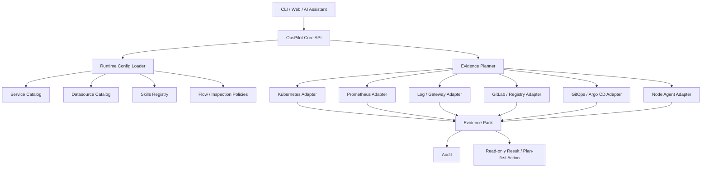
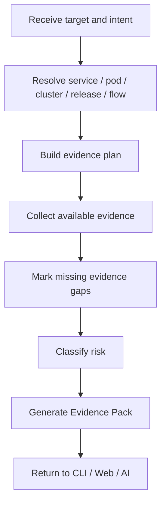
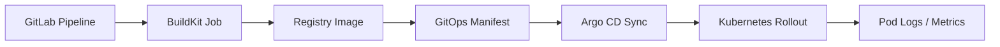
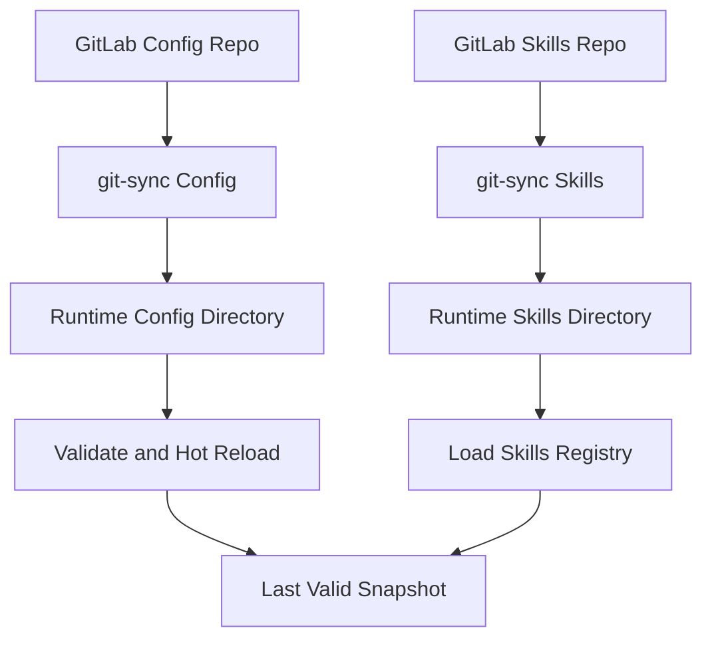
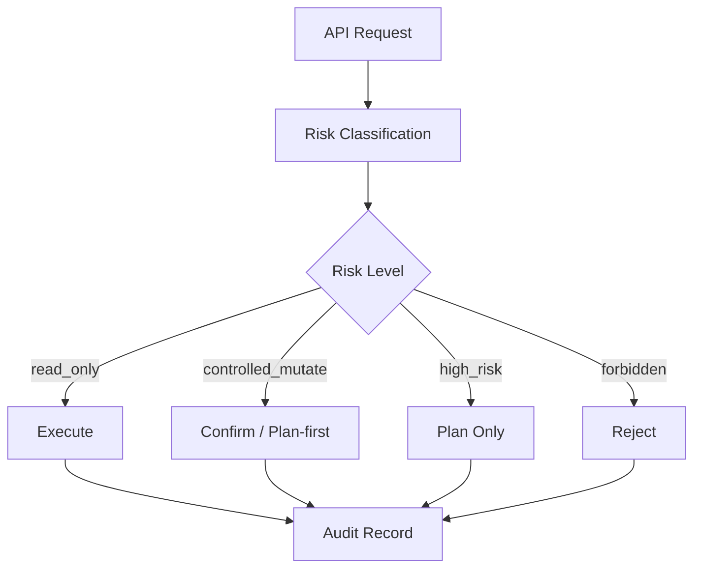

# 发明专利申请草案：一种证据包驱动的多源观测智能运维排障与发布控制方法、系统、设备及存储介质

> 说明：本文为基于 OpsPilot 现有设计整理的发明专利申请草案/技术交底书，不构成正式法律意见。正式提交前建议由专利代理师结合检索结果对新颖性、创造性、权利要求范围和术语一致性进行审查。

## 一、申请基础信息

| 项目 | 建议填写 |
| --- | --- |
| 专利类型 | 发明专利 |
| 发明名称 | 一种证据包驱动的多源观测智能运维排障与发布控制方法、系统、设备及存储介质 |
| 技术领域 | 云原生运维、AIOps、持续交付、可观测性、多源日志与指标关联分析 |
| 申请人 | 待填写：公司或个人名称 |
| 发明人 | 待填写：实际参与技术方案构思和实现的人员 |
| 联系人 | 待填写 |
| 是否要求优先权 | 默认否，若已有在先申请则补充 |
| 是否委托代理机构 | 建议委托 |
| 对应产品/系统 | OpsPilot |
| 关键词 | 证据包、服务目录、观测适配器、GitOps、发布证据链、运行时技能、风险分级、配置热加载 |

## 二、拟保护的核心创新点

1. 以服务目录、数据源目录、运行时技能目录和 GitLab 管理配置作为统一事实来源，将 Kubernetes、Prometheus、ES/Kibana、APISIX、GitLab、GitOps、Argo CD、节点 Agent 等证据统一封装为 Evidence Pack。
2. 在证据采集过程中采用“缺失证据显式化”机制，将缺失 Prometheus、日志、链路、GitLab、Argo CD 等情况标记为 evidence gap，而非使整个排障流程失败。
3. 将发布链路建模为从 GitLab Pipeline、BuildKit、镜像仓库、GitOps、Argo CD 到 Kubernetes rollout 的可验证证据链。
4. 采用 GitLab 管理的 YAML 配置和 git-sync 热加载机制，使多集群、多 ES/Kibana、多业务链路、巡检策略和技能路由可配置、可回滚。
5. 将 AI/自然语言排障限制在服务端受控能力内，通过运行时技能 registry 将自然语言意图映射到只读排查、受控发布、计划优先的高风险操作。
6. 通过风险分级、审计记录、保留策略和 plan-first 动作边界，使自动化排障与发布控制具备可追踪、可回滚、可扩展的治理能力。

## 三、说明书摘要

本发明公开了一种证据包驱动的多源观测智能运维排障与发布控制方法、系统、设备及存储介质。该方法以服务目录、数据源目录、发布目录、运行时技能目录和 GitLab 管理配置为事实来源，按目标服务、Pod、集群、发布任务或业务链路生成证据采集计划；通过观测适配器从 Kubernetes、Prometheus、日志检索系统、网关日志、GitLab、GitOps、Argo CD 及节点 Agent 获取证据，并将不可用数据源显式标记为证据缺口；再将证据、缺口、风险等级、下一步检查和计划型修复动作封装为证据包，供 CLI、API 或 AI 助手使用。该方案在缺失部分观测源时仍能保持可用，并能对发布失败、运行异常和业务链路中断进行可追踪分析。

## 四、摘要附图建议

建议指定“图1 系统总体架构图”为摘要附图。

## 五、权利要求书

### 权利要求1

一种证据包驱动的多源观测智能运维排障与发布控制方法，其特征在于，包括：

1. 接收来自命令行、Web 界面或人工智能助手的排障、巡检、发布状态查询或发布控制请求；
2. 根据所述请求解析目标对象，所述目标对象包括服务、Pod、集群、发布任务、业务链路或巡检策略中的至少一种；
3. 从服务目录、数据源目录、集群目录、发布目录、业务链路配置、巡检策略配置和运行时技能目录中生成证据采集计划；
4. 根据所述证据采集计划，通过多个观测适配器分别采集 Kubernetes 状态、事件、日志、Prometheus 指标、网关访问日志、应用日志、GitLab 流水线状态、镜像仓库状态、GitOps 期望状态、Argo CD 同步状态和节点 Agent 证据中的至少两类证据；
5. 对无法采集或未配置的证据源生成显式证据缺口标记；
6. 将已采集证据、证据缺口、风险等级、下一步检查建议和计划型修复动作封装为证据包；
7. 输出所述证据包，或基于所述证据包执行只读检查、受控发布动作或高风险动作的计划生成。

### 权利要求2

根据权利要求1所述的方法，其特征在于，所述服务目录包括服务名称、环境、分组、项目、负责人、代码仓库、域名、集群、命名空间、工作负载、容器、镜像、端口、日志索引、网关数据源、中间件、存储、配置源、GitLab 项目、GitOps 路径和 Argo CD 应用中的至少一种元数据。

### 权利要求3

根据权利要求1所述的方法，其特征在于，所述数据源目录包括 Prometheus、Elasticsearch、OpenSearch、Kibana、APISIX、Parca、Kafka exporter、节点 Agent 和 Kubernetes 集群访问配置中的至少一种，并且每个数据源具有名称、类型、环境、集群、地域、URL、索引、字段映射、凭证引用和查询选项中的至少一种属性。

### 权利要求4

根据权利要求1所述的方法，其特征在于，所述证据缺口标记包括日志源未配置、指标源不可用、网关日志不可用、服务日志不可用、发布映射缺失、GitLab 凭证缺失、Argo CD 数据源缺失、业务链路阶段证据缺失、巡检检查适配器未配置中的至少一种。

### 权利要求5

根据权利要求1所述的方法，其特征在于，所述方法在部分证据源不可用时不终止整个排障流程，而是保留可采集证据并将不可用证据源写入所述证据缺口标记。

### 权利要求6

根据权利要求1所述的方法，其特征在于，所述发布控制请求对应的发布证据链包括 GitLab 提交或流水线、GitLab Runner 作业、BuildKit 镜像构建、镜像仓库标签或摘要、GitOps 仓库变更、Argo CD 同步状态、Kubernetes Deployment rollout 状态以及 Pod 日志和指标中的至少两项。

### 权利要求7

根据权利要求6所述的方法，其特征在于，发布回退通过修改 GitOps 仓库中的期望镜像版本完成，并由 Argo CD 将所述期望状态同步至 Kubernetes 集群，而不直接在 Kubernetes 集群中执行镜像替换。

### 权利要求8

根据权利要求1所述的方法，其特征在于，所述业务链路配置包括由多个阶段组成的阶段图，所述阶段包括服务、容器、Kafka 主题、消费组、ClickHouse 表、HTTP 接口、日志索引或数据库表中的至少一种。

### 权利要求9

根据权利要求8所述的方法，其特征在于，当业务链路中的 Pod 包含多个容器时，所述方法根据默认容器配置确定日志采集目标；若默认容器缺失，则生成多容器默认目标缺失的证据缺口。

### 权利要求10

根据权利要求1所述的方法，其特征在于，所述巡检策略由 GitLab 管理的 YAML 配置定义，所述巡检策略包括集群、命名空间、服务、业务链路、检查项、阈值、数据源和启用状态中的至少一种；所述方法支持列出巡检策略、运行巡检策略形态检查以及生成巡检策略草案。

### 权利要求11

根据权利要求1所述的方法，其特征在于，所述运行时技能目录由 GitLab 仓库维护并同步至服务端本地目录，所述运行时技能目录包括技能元数据、执行指导、证据需求、可调用命令和安全边界；自然语言请求通过所述运行时技能目录映射到受控 API 或 CLI 命令。

### 权利要求12

根据权利要求11所述的方法，其特征在于，若运行时技能目录同步失败，则使用镜像内置的最小核心技能作为降级来源，并将技能同步失败作为能力缺口输出。

### 权利要求13

根据权利要求1所述的方法，其特征在于，所述方法按照风险等级控制动作执行，风险等级至少包括只读、受控变更、高风险计划和禁止动作；其中高风险计划包括命名空间删除、数据删除、hostPath 清理和凭证轮换中的至少一种，且仅生成方案而不自动执行。

### 权利要求14

根据权利要求1所述的方法，其特征在于，每个 API 请求生成审计记录，所述审计记录包括操作者、请求路径、目标类型、目标对象、风险等级、执行结果和脱敏查询参数中的至少一种，且不记录密码、令牌、kubeconfig 内容或 Kubernetes Secret 原始值。

### 权利要求15

根据权利要求1所述的方法，其特征在于，所述服务目录、数据源目录、业务链路配置、巡检策略配置和运行时技能目录通过 GitLab 仓库进行版本化管理，并通过 git-sync 同步到运行环境，由核心服务定期热加载；当新配置无效时保留上一份有效运行时快照。

### 权利要求16

一种证据包驱动的多源观测智能运维排障与发布控制系统，其特征在于，包括：

1. 请求解析模块，用于解析排障、巡检、发布状态查询或发布控制请求；
2. 配置加载模块，用于加载服务目录、数据源目录、业务链路配置、巡检策略配置和运行时技能目录；
3. 证据计划模块，用于根据目标对象生成证据采集计划；
4. 观测适配模块，用于从 Kubernetes、Prometheus、日志检索系统、网关日志、GitLab、GitOps、Argo CD 和节点 Agent 中采集证据；
5. 证据缺口模块，用于生成未配置或不可用证据源的缺口标记；
6. 证据包生成模块，用于封装证据、缺口、风险等级、下一步检查和计划型修复动作；
7. 审计模块，用于记录脱敏审计信息；
8. 输出模块，用于向 CLI、Web 或人工智能助手返回结果。

### 权利要求17

一种电子设备，包括处理器和存储器，所述存储器存储有计算机程序，所述计算机程序被所述处理器执行时实现权利要求1至15任一项所述的方法。

### 权利要求18

一种计算机可读存储介质，其上存储有计算机程序，所述计算机程序被处理器执行时实现权利要求1至15任一项所述的方法。

## 六、说明书

### 1. 技术领域

本发明涉及云原生运维、AIOps、持续交付、日志指标关联分析和自动化排障技术领域，尤其涉及一种证据包驱动的多源观测智能运维排障与发布控制方法、系统、设备及存储介质。

### 2. 背景技术

现有云原生应用通常由 Kubernetes、CI/CD 流水线、镜像仓库、GitOps、Argo CD、Prometheus、Elasticsearch/Kibana、APISIX/Nginx 网关、节点级 Agent 以及各类业务中间件共同组成。排查一个异常往往需要在多个平台之间切换，分别查看 Pod 状态、事件、日志、指标、网关访问日志、应用日志、发布流水线、镜像标签、GitOps 变更和 Argo CD 同步状态。

传统方案存在以下问题：

1. 观测数据割裂，缺少统一证据结构，AI 或非专业用户难以判断哪些证据已具备、哪些证据缺失。
2. 部分日志或指标源未接入时，排障流程容易整体失败，无法利用已有证据继续定位。
3. 发布链路长，GitLab、BuildKit、Registry、GitOps、Argo CD 和 Kubernetes rollout 之间缺少统一状态解释。
4. 多集群、多地域、多 ES/Kibana、多业务链路环境中，若进行全局搜索，容易造成查询成本高、结果噪声大、定位路径不清晰。
5. AI 自动化排障若缺少风险分级、审计和动作边界，可能产生越权、误删、泄露凭证或绕过 GitOps 的风险。
6. 业务链路可能已经中断，但各个服务本身仍然 Running，单纯依赖 Pod 健康检查无法发现链路级故障。

因此，需要一种能够把多源证据、缺失证据、发布状态、业务链路、配置治理和安全动作边界统一起来的智能运维方案。

### 3. 发明内容

#### 3.1 要解决的技术问题

本发明要解决的技术问题是：在多集群、多数据源、多发布工具和多业务链路环境下，如何生成统一、可审计、可供 AI 使用的排障证据包，并在部分观测源缺失时仍能保持排障流程可用，同时对发布控制和高风险操作进行边界约束。

#### 3.2 技术方案

为解决上述问题，本发明提供一种证据包驱动的多源观测智能运维排障与发布控制方法。

该方法包括：

1. 建立服务目录，用于描述服务与代码仓库、域名、集群、命名空间、Deployment、容器、镜像、端口、日志索引、中间件、配置源、GitLab 项目、GitOps 路径和 Argo CD 应用之间的关系。
2. 建立数据源目录，用于描述 Prometheus、ES/OpenSearch、Kibana、APISIX、Parca、Kafka exporter、节点 Agent 和 Kubernetes 集群访问配置。
3. 建立运行时技能目录，用于描述自然语言请求如何路由到受控排障命令、证据收集顺序和安全边界。
4. 建立业务链路配置，将跨服务、消息队列、数据库、日志索引和接口的长链路拆分为多个可观察阶段。
5. 建立巡检策略配置，将集群、服务、命名空间、业务链路、检查项、阈值和数据源以 YAML 形式管理。
6. 将上述目录和配置存储在 GitLab 仓库中，通过 git-sync 同步至核心服务，并通过热加载机制读取最新有效配置。
7. 当用户或 AI 发起排障、巡检或发布状态查询时，核心服务根据目标对象生成证据采集计划。
8. 核心服务通过观测适配器从各类数据源采集证据，生成统一 Evidence Pack。
9. 对未配置、不可达或尚未实现适配器的数据源生成 evidence gap，而不是中断整个排障流程。
10. 对发布场景，按 GitLab Pipeline、BuildKit、Registry、GitOps、Argo CD、Kubernetes rollout、Pod 日志和指标生成发布证据链。
11. 对操作动作按只读、受控变更、高风险计划和禁止动作进行风险分级；高风险动作只生成方案，不自动执行。
12. 对 API 请求生成审计记录，并对密码、令牌、kubeconfig、Secret 等敏感信息进行脱敏。

#### 3.3 有益效果

与现有技术相比，本发明至少具有以下有益效果：

1. 多源证据统一封装为 Evidence Pack，便于人工、CLI、Web 和 AI 共同使用。
2. 缺失证据显式化，使排障过程不会因为某个数据源未接入而整体不可用。
3. 发布链路可解释，可快速定位失败发生在 GitLab、BuildKit、Registry、GitOps、Argo CD、Kubernetes 或日志指标阶段。
4. 多集群、多地域、多日志源场景下可通过服务目录和数据源路由缩小查询范围，避免全局盲搜。
5. 运行时技能服务端化，客户端无需安装技能包，AI 调用受控、可审计、可更新。
6. 高风险动作 plan-first，降低自动化误操作风险。
7. GitLab 管理配置和技能，便于人工维护、版本回滚和跨集群迁移。
8. 业务链路按阶段建模，即使 Pod 全部 Running，也能通过日志、消息堆积、数据库写入等证据发现链路级故障。

### 4. 附图说明

图1为本发明系统总体架构图。

图2为证据包生成流程图。

图3为发布证据链状态关联图。

图4为运行时配置和技能热加载流程图。

图5为风险分级和审计流程图。

### 5. 具体实施方式

#### 5.1 系统总体架构

系统包括客户端入口、核心 API、配置加载器、服务目录、数据源目录、技能注册表、证据计划器、多个观测适配器、证据包生成器、审计模块、保留清理模块和输出模块。

客户端入口可以是 CLI、Web 页面或 AI 助手。客户端不保存 kubeconfig、数据源密码、GitLab 高权限令牌或技能执行策略。客户端只提交目标对象和操作意图。

核心 API 接收到请求后，通过服务目录和数据源目录确定目标服务所在集群、命名空间、Deployment、容器、日志索引、网关数据源和发布映射。

#### 5.2 GitLab 管理配置

配置仓库可以包括：

```text
settings/
clusters/
datasources/
credentials/
agents/
services/
flows/
inspections/
schemas/
```

核心服务启动时由 init container 拉取配置，运行时由 git-sync sidecar 持续同步。核心服务定期读取配置目录并校验 YAML。若新配置无效，则保持上一份有效快照，避免错误配置导致服务能力突然失效。

#### 5.3 证据包生成

当用户请求检查某服务时，系统执行：

1. 从服务目录读取服务元数据；
2. 查询 Kubernetes Deployment 和 Pod 状态；
3. 查询事件和短窗口 Pod 日志；
4. 查询 Prometheus 中的 CPU、内存、重启和文件系统证据；
5. 如果配置了网关日志，则按域名、URI、状态码和时间窗口查询 APISIX 或 Nginx 日志；
6. 如果配置了应用日志，则按服务日志索引查询 ES/OpenSearch；
7. 如果配置了发布映射，则查询 GitLab、Registry、GitOps 和 Argo CD；
8. 汇总证据，生成 Evidence Pack。

Evidence Pack 示例：

```json
{
  "target_type": "service",
  "target": "opspilot-core",
  "status": "degraded",
  "evidence": [
    {"source": "kubernetes", "message": "deployment ready 1/1"},
    {"source": "prometheus", "message": "pod cpu normal"},
    {"source": "gitops", "message": "desired image matches cluster"}
  ],
  "missing_evidence": [
    "elk_logs_missing",
    "apisix_logs_missing"
  ],
  "next_checks": [
    "inspect recent pod events",
    "check release job logs"
  ]
}
```

#### 5.4 发布证据链

发布链路按照如下顺序形成证据：

```text
Git push
-> GitLab pipeline
-> GitLab Runner job
-> BuildKit image build
-> Registry image tag
-> GitOps manifest update
-> Argo CD sync
-> Kubernetes rollout
-> Pod logs and metrics
```

系统不是替代上述组件，而是查询上述组件的只读状态，判断发布当前处于 running、success、failed、progressing、degraded 或 unknown 阶段。

当需要回退时，系统不直接调用 Kubernetes 修改 Deployment，而是向 GitOps 仓库提交旧镜像标签，由 Argo CD 负责同步，使 GitOps 保持期望状态来源。

#### 5.5 业务链路 Flow

对于日志上报、消息消费、数据写入等跨服务链路，系统使用 Flow 配置描述业务阶段。例如：

```yaml
kind: Flow
metadata:
  name: exception-tracking-crash
spec:
  stages:
    - name: collector
      type: service
      workload: exception-tracking-collect-server
      default_container: collect-server
    - name: collector-topic
      type: kafka_topic
      topic: exception-tracking-collector
      consumer_group: exception-tracking-preagg
    - name: clickhouse-final
      type: clickhouse
      table: crash_report_data
```

系统对每个阶段生成阶段证据和缺口。即使每个 Pod 都 Running，也可以通过 Kafka lag、日志关键字、数据库近时写入量等证据判断链路是否中断。

#### 5.6 可配置巡检 Inspection

巡检策略定义检查项和阈值：

```yaml
kind: Inspection
metadata:
  name: node200-daily
spec:
  cluster: node200-test
  checks:
    - name: node-resources
      type: node_resources
      thresholds:
        cpu_usage_percent: 85
        memory_usage_percent: 85
    - name: filesystems
      type: filesystems
      thresholds:
        usage_percent: 85
        free_gib: 20
```

系统可列出巡检策略、运行巡检策略形态检查、生成巡检策略草案，并将未接入的检查适配器标记为缺口。

#### 5.7 运行时技能

系统将 AI 技能服务端化。技能文件由 GitLab 仓库维护，运行时通过 git-sync 同步。技能元数据描述适用场景、所需证据、允许命令和安全边界。

当用户输入自然语言，例如“检查某服务是否发布成功”时，系统通过技能注册表映射到发布证据链命令，而不是让客户端任意执行 shell 或访问凭证。

#### 5.8 风险分级与审计

系统将动作分为：

| 风险等级 | 自动化策略 |
| --- | --- |
| read_only | 自动执行 |
| controlled_mutate | 显式确认或计划优先 |
| high_risk | 只生成方案 |
| forbidden | 拒绝执行 |

每次 API 请求都写入审计记录，包括操作者、路径、目标、风险等级、结果和脱敏参数。系统不在审计或证据包中输出密码、令牌、kubeconfig 或 Secret 明文。

### 6. 可替代实施方式

1. 配置源可以由 GitLab 替换为其他版本化配置仓库，例如 Gitea、GitHub Enterprise 或内部配置中心。
2. 日志检索系统可以是 Elasticsearch、OpenSearch、Loki 或 OpenObserve。
3. 发布控制系统可以是 Argo CD、Flux CD 或其他 GitOps 控制器。
4. 运行时技能可以通过镜像内置、对象存储或数据库缓存提供，但需保持服务端受控和版本化。
5. 审计和证据包存储可由本地文件替换为数据库或对象存储。

## 七、附图草案

### 图1 系统总体架构图



### 图2 证据包生成流程图



### 图3 发布证据链



### 图4 配置和技能热加载



### 图5 风险分级与审计



## 八、申请文件规范提示

根据国家知识产权局公开说明，发明专利通常需要提交《发明专利请求书》《说明书》《权利要求书》《说明书摘要》，必要时提交《说明书附图》和《摘要附图》。申请文件应使用国家知识产权局统一表格，并按官方要求排列。正式提交时应将本文内容拆分为：

1. 发明专利请求书；
2. 说明书摘要；
3. 摘要附图；
4. 权利要求书；
5. 说明书；
6. 说明书附图。

## 九、提交前补充清单

| 项目 | 状态 | 说明 |
| --- | --- | --- |
| 申请人 | 待补 | 公司或个人全称 |
| 发明人 | 待补 | 仅填写对技术方案有实质贡献人员 |
| 是否公开过 | 待确认 | 如已公开演示、发文、开源，需要评估新颖性影响 |
| 是否已有同类专利 | 待检索 | 建议进行关键词和 IPC/CPC 检索 |
| 最核心权利要求 | 待代理师打磨 | 当前权利要求偏系统性，后续可聚焦 Evidence Pack + evidence gap + release chain |
| 附图 | 待制图 | Mermaid 可转为正式线框图 |
| 实施例数据 | 可补 | 可补充一次真实发布/排障流程作为实施例 |

